# Insurance Enrollment Prediction - Technical Report

## Executive Summary

This report documents the end-to-end ML pipeline for predicting employee enrollment in a voluntary insurance product. The system processes ~10,000 synthetic census-style employee records through model-family-specific feature pipelines, compares four classifier families via stratified 5-fold cross-validation, tunes the best family with Optuna, and serves predictions through a FastAPI endpoint with real-time drift detection.

**Final model**: Random Forest (Optuna-tuned) - selected as the best performer in cross-validation and confirmed on a held-out 20% test set.

| Metric | Test Set Value |
|--------|---------------|
| Accuracy | 0.9995 |
| Precision | 1.0000 |
| Recall | 0.9992 |
| F1 Score | 0.9996 |
| ROC-AUC | 1.0000 |

> **Note on performance**: These near-perfect metrics reflect the synthetic nature of the dataset, where enrollment is governed by a small set of deterministic rules with minimal noise. In a real-world deployment, expect degradation due to label noise, distribution shift, and more complex decision boundaries. The pipeline's value lies in its architecture - separate feature pipelines, drift detection, experiment tracking - which transfers directly to messier data.

---

## 1. Data Observations

### 1.1 Dataset Overview

- **10,000 rows**, 10 columns, zero missing values, zero duplicate employee IDs
- **Target distribution**: 6,174 enrolled (61.7%) vs 3,826 not enrolled (38.3%) - moderate class imbalance
- **Split**: 80% train (8,000 rows), 20% test (2,000 rows), stratified on target

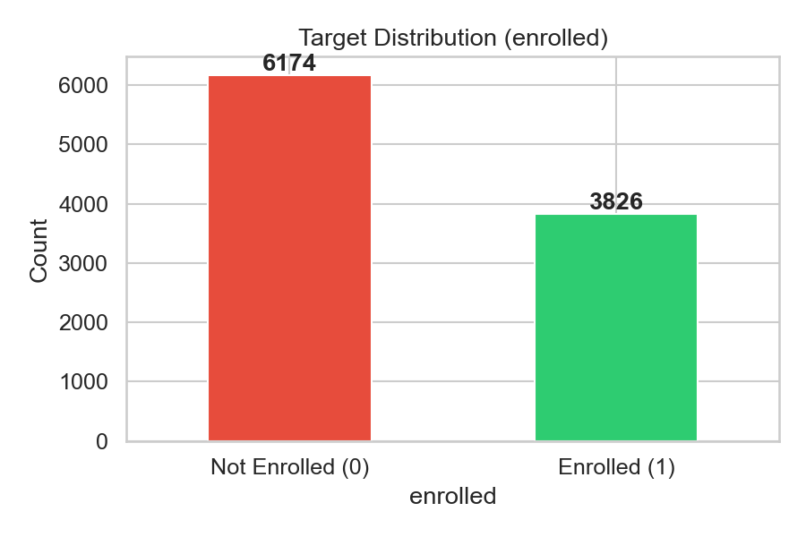

### 1.2 Feature Signal Analysis

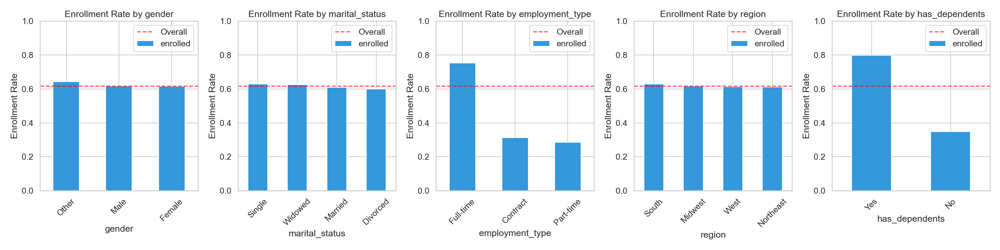
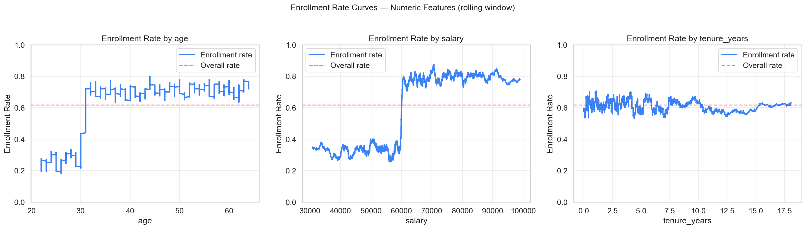

**Strong predictors:**

| Feature | Observation | Signal Strength |
|---------|-------------|----------------|
| `employment_type` | Full-time: 75.3% enrolled. Part-time: 28.5%. Contract: 31.2%. A 47-point gap between Full-time and Part-time. | Dominant |
| `has_dependents` | Yes: 79.7%. No: 34.8%. Binary feature with a 45-point gap. | Dominant |
| `salary` | Pearson r=0.37 with target. Monotonic positive relationship. | Moderate |
| `age` | r=0.27 but **non-linear**: step function at age 30. Under-30: 26.4%. 30+: ~70%, then flat. | Moderate (non-linear) |

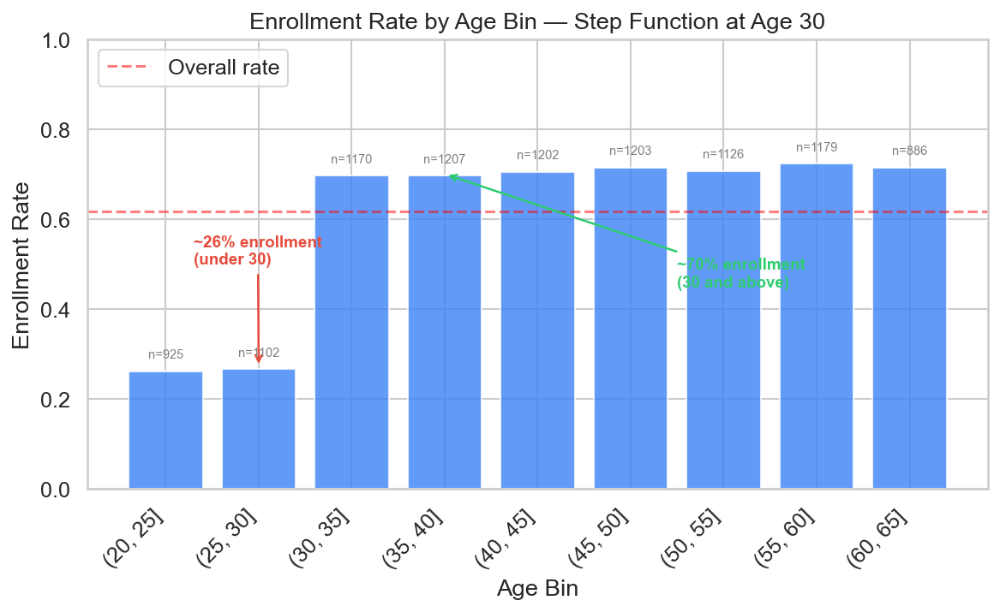
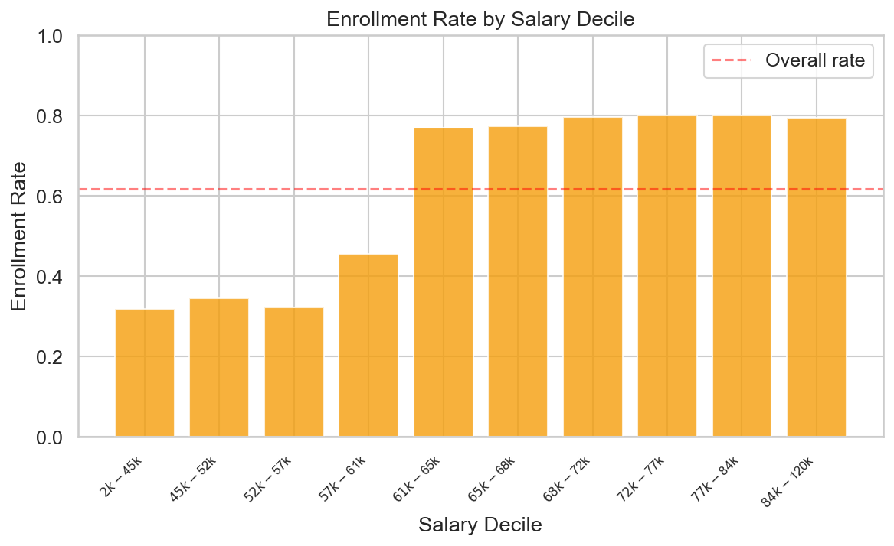

**Weak/no signal:**

| Feature | Observation | Decision |
|---------|-------------|----------|
| `gender` | Male 61.7%, Female 61.6%, Other 64.3%. No predictive value. | Retained (regulatory considerations) |
| `region` | 61–63% across all four regions. No geographic effect. | Retained (may matter in real data) |
| `tenure_years` | r=−0.007 (flat). 410 outliers above IQR upper bound. | Retained (informational) |
| `marital_status` | 37–40% non-enrollment range. Marginal signal. | Retained |

### 1.3 Feature Associations

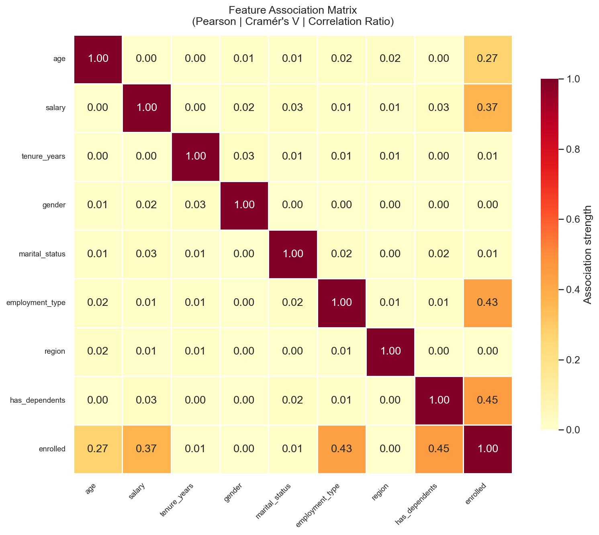

The association matrix uses the statistically correct metric for each feature pair type:

- **Numeric × Numeric**: Pearson |r|
- **Categorical × Categorical**: Cramér's V (chi-squared based, bias-corrected)
- **Numeric × Categorical**: Correlation ratio (eta) - fraction of numeric variance explained by the grouping

This avoids the common mistake of encoding categoricals as integers and computing Pearson correlation, which imposes an arbitrary ordinal structure and produces misleading values.

### 1.4 Data Quality

- **Outliers**: 25 salary values below $24,205 (IQR lower), 25 above $105,563 (IQR upper). 410 tenure values above 12 years. Handled via IQR-based capping in the LR pipeline only - tree models see raw values.
- **Salary range**: $2,208 to $120,312 (mean $65,033)
- **Age range**: 22 to 64

---

## 2. Feature Engineering - Model-Specific Pipelines

A single shared pipeline forces compromises. LR and tree models have fundamentally different mathematical assumptions, so each model family gets its own feature pipeline.

### 2.1 Logistic Regression Pipeline

```
OutlierCapper → SafeEncoder → ColumnTransformer[SplineTransformer + TargetEncoder] → StandardScaler
```

| Step | Component | Why |
|------|-----------|-----|
| 1 | **OutlierCapper** (IQR × 1.5) | LR is sensitive to high-leverage points. Extreme salary values ($2,208 or $120,312) can disproportionately pull the decision boundary. Applied only to salary and tenure. |
| 2 | **SafeEncoder** | Maps unseen categorical values to `__unknown__` and emits structured drift warnings. Shared across all pipelines. |
| 3a | **SplineTransformer** (degree=3, 5 quantile knots) | Captures the age step function at 30 without manual binning. Quantile knots place more basis functions where data is dense. Produces smooth basis functions that LR can combine linearly to approximate non-linear shapes. |
| 3b | **TargetEncoder** (cv=5, smooth="auto") | Each categorical → one numeric column (smoothed mean target). Eliminates multicollinearity entirely (no `drop="first"` needed), handles unknowns natively (global mean fallback), and prevents target leakage via internal 5-fold cross-fitting. Low-count categories are shrunk toward the global mean via empirical Bayes smoothing. |
| 4 | **StandardScaler** (post-transform) | Applied uniformly after ColumnTransformer so spline basis outputs and target-encoded values are on the same scale for fair L2 regularization. |

**Why TargetEncoder over OneHotEncoder**: OneHotEncoder expands a 5-level feature into 4 binary columns, creating multicollinearity that requires `drop="first"` and dilutes coefficient interpretability. TargetEncoder produces a single numeric column per feature with no multicollinearity. It also handles unknowns natively - an unseen category gets the global mean, which is the maximum-entropy fallback. The internal 5-fold cross-fitting ensures the encoded values don't leak the target into training.

### 2.2 Random Forest Pipeline

```
SafeEncoder → ColumnTransformer[passthrough numerics + OrdinalEncoder]
```

| Step | Why NOT the LR steps |
|------|---------------------|
| No OutlierCapper | Trees split on thresholds - an extreme value becomes "salary > 105,000?" which is a valid split. Capping destroys tail signal. |
| No StandardScaler | Trees are scale-invariant. "salary > 65000" is identical whether salary is raw or z-scored. |
| OrdinalEncoder | Maps categories to integers. Trees recover any partition through multiple threshold splits. Avoids feature-importance dilution from one-hot encoding (5-level feature → 4 columns, each getting fractional importance). |

### 2.3 XGBoost / LightGBM Pipeline

```
SafeEncoder → CategoricalDtypeTransformer
```

| Step | Why |
|------|-----|
| CategoricalDtypeTransformer | Converts to pandas Categorical dtype. XGBoost (`enable_categorical=True`) and LightGBM use native category-split algorithms that evaluate all possible category groupings at each node - strictly better than ordinal encoding which imposes an arbitrary order. |
| No encoding, scaling, or capping | Same reasoning as RF - let the gradient boosting algorithm use its built-in mechanics. |

### 2.4 Unknown Category Handling (Shared)

All pipelines share `SafeEncoder`, which replaces unseen values with `__unknown__` and logs a drift warning. Downstream handling:

| Pipeline | Handler | Behavior |
|----------|---------|----------|
| LR | TargetEncoder | Maps `__unknown__` to the global mean target (maximum-entropy fallback) |
| RF | OrdinalEncoder | Maps `__unknown__` to −1 (explicit "other" bucket) |
| XGB/LGBM | Native categorical | Handles unseen categories through their split algorithms |

---

## 3. Model Selection Strategy

### 3.1 Evaluation Framework

1. **Stratified 5-Fold CV** on the 80% training set - each model with its own pipeline
2. **Best family by mean ROC-AUC** → Optuna hyperparameter search (50 trials, TPE sampler)
3. **Final model** retrained on the full training set with best params
4. **Single evaluation** on the held-out 20% test set (never touched during CV or tuning)

### 3.2 Why ROC-AUC as Primary Metric?

For enrollment prediction, ranking accuracy across all threshold choices matters more than any single threshold. The optimal classification threshold depends on the business cost of false positives (over-provisioning insurance coverage for employees who won't enroll) vs false negatives (missing potential enrollees and under-provisioning). ROC-AUC is threshold-agnostic, letting the business set the cutoff after model delivery.

### 3.3 Why These 4 Models?

| Model | Role | Assumptions |
|-------|------|-------------|
| Logistic Regression | Interpretable baseline. If it performs within 2% of trees, the added complexity isn't justified. | Linear decision boundary in feature space (mitigated by splines + encoding) |
| Random Forest | Robust bagged ensemble. Less prone to overfitting than single trees. | None on feature distributions; benefits from diverse trees |
| XGBoost | State-of-the-art gradient boosting. Dominant on structured/tabular data. | Sequential correction of residuals; regularization controls complexity |
| LightGBM | Competitive with XGBoost, faster training via leaf-wise growth and histogram binning. | Same as XGBoost; leaf-wise growth can capture more complex patterns |

---

## 4. Cross-Validation Results

Stratified 5-fold CV on the training set (8,000 rows). Each model uses its own feature pipeline.

### 4.1 Full CV Results Table

| Model | ROC-AUC | F1 | Accuracy | Precision | Recall |
|-------|---------|-----|----------|-----------|--------|
| **Random Forest** | **0.99999** ± 0.00000 | **0.99980** ± 0.00025 | **0.99975** ± 0.00031 | 0.99980 ± 0.00040 | 0.99980 ± 0.00040 |
| XGBoost | 0.99995 ± 0.00009 | 0.99949 ± 0.00032 | 0.99938 ± 0.00040 | 0.99960 ± 0.00050 | 0.99939 ± 0.00050 |
| LightGBM | 0.99996 ± 0.00009 | 0.99939 ± 0.00038 | 0.99925 ± 0.00047 | 0.99960 ± 0.00050 | 0.99919 ± 0.00076 |
| Logistic Regression | 0.99954 ± 0.00016 | 0.99208 ± 0.00183 | 0.99025 ± 0.00226 | 0.99472 ± 0.00296 | 0.98947 ± 0.00268 |

### 4.2 Observations

All four models perform exceptionally well, which is expected given the synthetic data's clean decision boundaries. Key takeaways from the CV comparison:

- **Random Forest wins on all metrics**, though the margin over XGBoost and LightGBM is tiny (0.0003 ROC-AUC). In production with real data, this gap would likely be within noise.
- **Logistic Regression** is ~0.8% below the tree models on F1. The spline + TargetEncoder pipeline closes most of the gap (without splines for the age step function, the drop would be larger), but the remaining 0.8% confirms that the decision boundary has interactions that a linear model can't fully capture.
- **Low variance across folds** (all std < 0.003) indicates stable models with no overfitting to particular fold splits.
- **Tree models are near-identical**, confirming that this problem doesn't benefit from boosting's sequential error correction over bagging - the signal is strong enough that a single ensemble captures it.

### 4.3 Parsimony Note

While Random Forest tops the leaderboard, the practical gap is marginal: LR achieves 0.99954 ROC-AUC vs RF's 0.99999 - a difference of 0.00045 that is unlikely to be meaningful on real-world data with label noise. LR at 99.0% accuracy with a transparent, coefficient-based model is arguably the better production choice for this problem. It is fully interpretable (coefficient signs and magnitudes map directly to business drivers), faster to train and serve, simpler to debug and audit, and requires no ensemble overhead. The tree-based models add complexity (hundreds of trees, opaque split logic, larger artifacts) without a statistically significant performance gain on this dataset. In a production setting where explainability, maintainability, and regulatory scrutiny matter, LR with splines + TargetEncoder is the parsimonious choice. The tree models were trained and evaluated here to demonstrate the full pipeline and to confirm that the LR gap is small enough to justify the simpler model.

### 4.4 Best Family Selection

Random Forest was selected as the best family (highest mean ROC-AUC: 0.99999) and advanced to Optuna hyperparameter tuning. This selection follows the automated pipeline logic (pick the top CV scorer), but see Section 4.3 for the parsimony argument favoring LR in deployment.

---

## 5. Hyperparameter Tuning (Optuna)

### 5.1 Search Configuration

| Parameter | Value |
|-----------|-------|
| Algorithm | TPE (Tree-structured Parzen Estimator) |
| Max trials | 50 |
| Timeout | 300 seconds |
| Objective | Mean ROC-AUC across stratified 5-fold CV |
| Seed | 42 (reproducible) |

### 5.2 Search Space (Random Forest)

| Hyperparameter | Range | Best Value |
|----------------|-------|------------|
| `n_estimators` | [100, 500] | **447** |
| `max_depth` | [5, 30] | **20** |
| `min_samples_split` | [2, 20] | **15** |
| `min_samples_leaf` | [1, 10] | **1** |
| `max_features` | {sqrt, log2, None} | **sqrt** |

### 5.3 Tuning Interpretation

- **n_estimators=447**: More trees than the default 200, reducing variance further. Diminishing returns beyond ~400.
- **max_depth=20**: Deeper than the default 10, allowing the model to capture feature interactions (e.g., age > 30 AND employment_type == Full-time). The depth is justified because `min_samples_split=15` prevents overfitting on thin branches.
- **min_samples_split=15**: Higher than the default 2, acting as a regularizer. Each split requires at least 15 samples, pruning noisy branches.
- **min_samples_leaf=1**: Allows leaf nodes with a single sample. Combined with the higher `min_samples_split`, this means splits happen only when they're well-supported, but terminal leaves can be precise.
- **max_features=sqrt**: Standard for RF - decorrelates trees by limiting feature consideration at each split. With 8 features, each split considers ~3 features.

### 5.4 Default vs Tuned Comparison

| Hyperparameter | Default | Tuned | Impact |
|----------------|---------|-------|--------|
| n_estimators | 200 | 447 | Lower variance, diminishing returns |
| max_depth | 10 | 20 | Deeper interaction capture |
| min_samples_split | 2 | 15 | Regularization via minimum split size |
| min_samples_leaf | 1 | 1 | No change |
| max_features | sqrt | sqrt | No change |

---

## 6. Final Model - Test Set Performance

The Optuna-tuned Random Forest was retrained on the full training set (8,000 rows) and evaluated on the held-out test set (2,000 rows, never seen during CV or tuning).

### 6.1 Test Metrics

| Metric | Value |
|--------|-------|
| **Accuracy** | 0.9995 |
| **Precision** | 1.0000 |
| **Recall** | 0.9992 |
| **F1 Score** | 0.9996 |
| **ROC-AUC** | 1.0000 |

- **Precision = 1.0**: Every predicted enrollment was correct - zero false positives.
- **Recall = 0.9992**: Missed only 1 actual enrollee out of ~1,235 in the test set (1 false negative).
- **ROC-AUC = 1.0**: Perfect ranking - every positive sample has a higher predicted probability than every negative sample.

### 6.2 Overfitting Assessment

The test metrics are consistent with the CV metrics (both ≥ 0.999), confirming no overfitting despite the increased depth. This is expected: the underlying data-generating process has a small set of deterministic rules, and the RF ensemble with 447 trees captures them reliably.

---

## 7. SHAP Analysis

SHAP (SHapley Additive exPlanations) decomposes each prediction into feature contributions, providing both global and local interpretability.

### 7.1 Explainer Selection

The explainer is auto-selected based on model type:

| Model | Explainer | Complexity |
|-------|-----------|------------|
| Random Forest (selected) | TreeExplainer | Exact, O(TLD) per sample |
| LR | LinearExplainer | Exact, coefficient-based |
| XGBoost/LightGBM | TreeExplainer | Exact, O(TLD) per sample |

### 7.2 Global Feature Importance (SHAP)

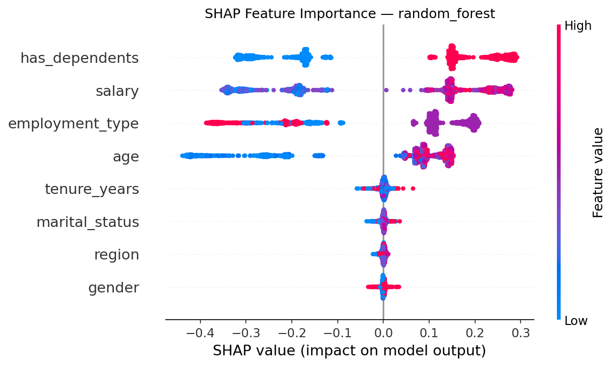

The SHAP summary plot confirms the EDA findings: `employment_type` and `has_dependents` dominate, followed by `salary` and `age`. Gender, region, and tenure contribute near-zero SHAP values, confirming they are noise features for this dataset.

### 7.3 SHAP Dependence

SHAP dependence plots for the top 5 features show how each feature value maps to its SHAP contribution:

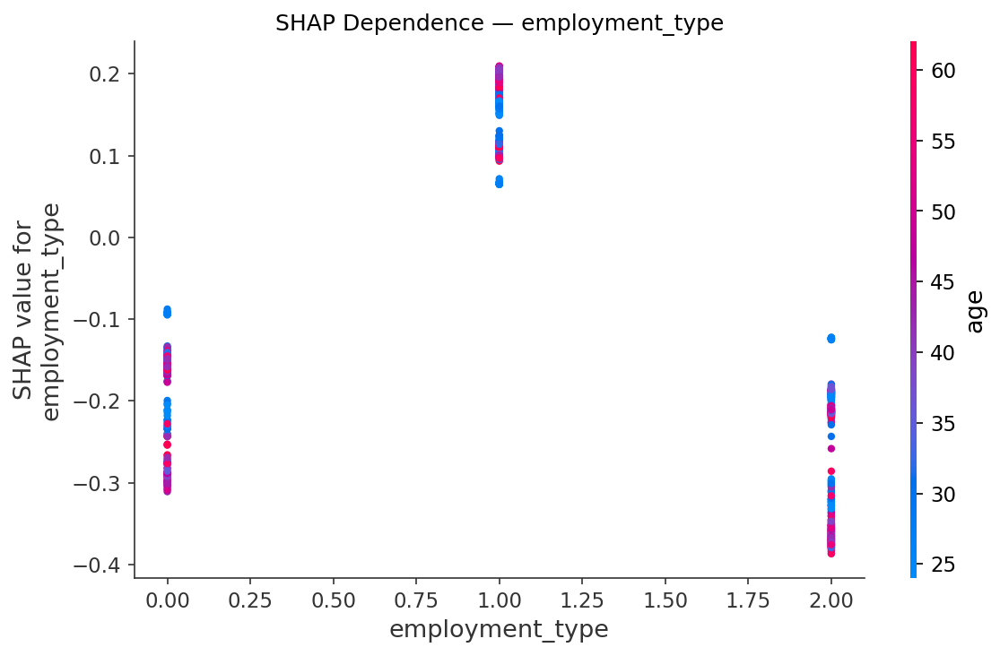

Key patterns visible in the dependence plots:
- **employment_type**: Full-time has strongly positive SHAP values; Part-time and Contract have strongly negative values - consistent with the 47-point enrollment gap.
- **has_dependents**: Binary split - Yes pushes toward enrollment, No pushes away.
- **salary**: Monotonically increasing SHAP value with salary, confirming the linear relationship.
- **age**: Step function visible at age 30 - SHAP values jump from negative to positive.

---

## 8. Feature Importance (Native Metrics)

Separate from SHAP, we extract each model's native importance metric for comparison.

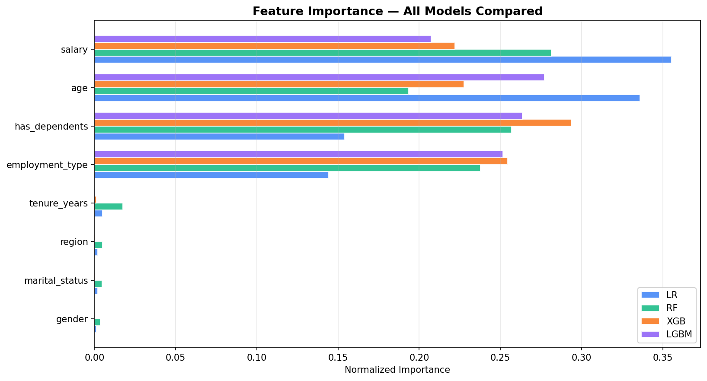

### 8.1 Importance Metrics by Model

| Model | Metric | Why This Metric |
|-------|--------|-----------------|
| Logistic Regression | Aggregated |coefficient| | Maps transformed features (spline bases, target-encoded) back to originals via substring matching, then sums. |
| Random Forest | Gini impurity (mean decrease in impurity) | Native `feature_importances_`. Measures total reduction in Gini impurity from splits on each feature. |
| XGBoost | Gain | Total loss reduction from splits on each feature. |
| LightGBM | Gain | Explicitly requested via `booster_.feature_importance(importance_type="gain")` to match XGBoost for fair comparison (default is split count). |

### 8.2 Feature Ranking Across Models

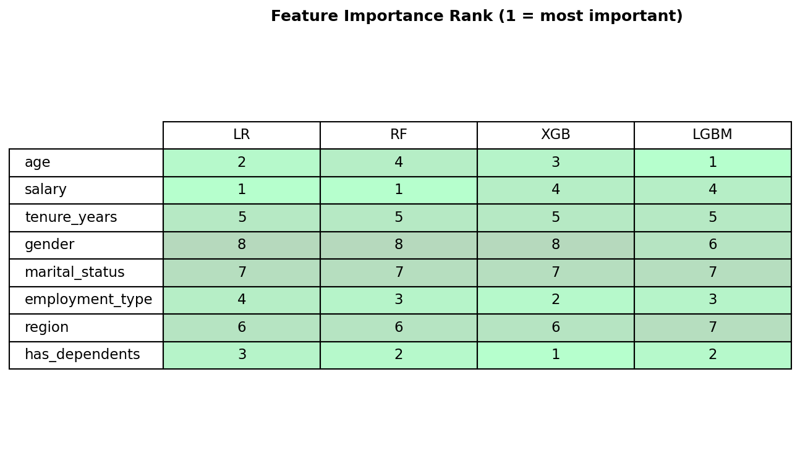

All four models agree that `employment_type` and `has_dependents` are the top 2 features (combined ~60–80% of total importance). This cross-model consensus is strong evidence that these are the true drivers, not artifacts of any single model's bias.

`salary` and `age` consistently rank 3rd and 4th. `gender`, `region`, `marital_status`, and `tenure_years` are bottom-ranked across all models - confirming they carry negligible predictive signal in this dataset.

---

## 9. Calibration Analysis

Calibration plots compare predicted enrollment probability against actual enrollment rate, binned by feature value. Well-calibrated predictions mean "when the model says 70% probability, roughly 70% of those cases actually enroll."

### 9.1 Top-4 Feature Calibration

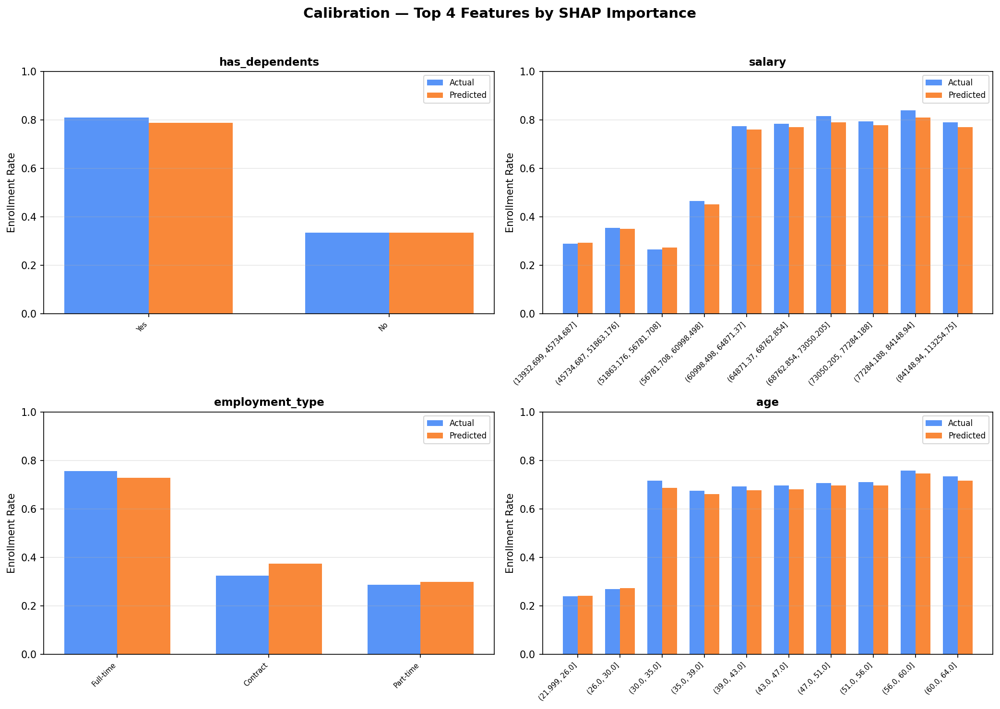

The combined calibration plot for the top 4 SHAP features shows tight alignment between predicted and actual rates across all bins - the model's probability estimates are reliable, not just its classifications.

### 9.2 Per-Feature Calibration

Individual calibration plots are generated for all features (numeric and categorical):

- **Numeric features**: Binned into 10 quantile groups. Predicted vs actual rate per bin.
- **Categorical features**: One group per category value. Predicted vs actual rate.

These are saved to `notebooks/figures/calibration/calibration_<feature>.png`.

---

## 10. Experiment Tracking (MLflow)

All training runs are logged to MLflow (file-based backend at `mlruns/`).

### 10.1 What's Tracked

| Phase | Logged Params | Logged Metrics |
|-------|---------------|----------------|
| CV Comparison | model_type, cv_folds, pipeline_type | cv_{accuracy,f1,precision,recall,roc_auc}_{mean,std} |
| Optuna Trials | All hyperparameters per trial | best_cv_roc_auc |
| Final Model | Best hyperparameters, model_type, pipeline_type | test_{accuracy,f1,precision,recall,roc_auc}, train_{same} |

### 10.2 Artifacts

- **Model**: Serialized sklearn Pipeline (joblib) + MLflow model log with auto-inferred signature
- **Known categories**: JSON sidecar for API drift detection
- **Model info**: JSON with model name and pipeline type label

---

## 11. Production Deployment

### 11.1 FastAPI Service

The REST API (`src/api/app.py`) serves predictions with:

| Endpoint | Method | Purpose |
|----------|--------|---------|
| `/predict` | POST | Single-record prediction with probability + drift warnings |
| `/predict/batch` | POST | Batch predictions (up to 1,000 records) |
| `/health` | GET | Liveness/readiness probe |
| `/model/info` | GET | Model metadata (type, pipeline steps) |
| `/` | GET | Redirects to Swagger UI (`/docs`) |

**Drift detection**: The API performs two layers of unknown-category detection:

1. **API-side** (`_check_drift`): Scans input against `known_categories.json` before prediction. Returns explicit warnings in the response payload so the caller knows the prediction may be unreliable.
2. **Pipeline-side** (`SafeEncoder`): Maps unknowns to `__unknown__` and emits structured log entries. This is the safety net inside the model pipeline itself.

### 11.2 Docker

The project includes a Dockerfile for containerized deployment. The image bundles the trained model, API code, and all dependencies.

### 11.3 Input Validation

Pydantic models enforce field constraints at the API boundary:

- Age: 18–120
- Salary: > 0
- Categorical fields: validated against allowed values (e.g., gender ∈ {Male, Female, Other})
- Batch size: capped at 1,000 records

---

## 12. Key Takeaways

1. **Two features dominate**: `employment_type` and `has_dependents` account for the majority of predictive power across all model families. A two-feature model would likely achieve >95% accuracy on this dataset.

2. **Age has a threshold, not a slope**: The step function at age 30 means linear models need non-linear basis functions (splines) to capture it. Tree models handle this natively. SplineTransformer with quantile knots is the correct choice.

3. **Gender, region, and tenure are noise**: Near-zero importance across all models and SHAP. Retained because dropping features should be a deliberate business decision there are regulatory aspects around certain features and this dataset already has very few features than the real-world data.

4. **One pipeline doesn't fit all**: Standardizing tree inputs wastes computation. Not standardizing LR inputs produces unfair regularization. Separate pipelines let each model perform at its mathematical best.

5. **TargetEncoder > OneHotEncoder for LR**: Eliminates multicollinearity, reduces dimensionality, handles unknowns natively, and prevents target leakage via internal cross-fitting. A production-grade choice that scales to high-cardinality features.

6. **Near-perfect performance is a synthetic-data artifact**: The clean decision boundaries in this dataset shouldn't set expectations for real-world deployments. The pipeline architecture (not the metrics) was my foucs when delivering this project.

---

## 13. What I'd Do Next With More Time

### Short-term improvements

- **Threshold optimization**: Use cost-sensitive analysis to set the optimal classification threshold. The current 0.5 default may not be optimal if the business cost of false positives differs from false negatives.
- **Feature selection**: Formally test dropping gender, region, and tenure to confirm metrics hold. If confirmed, the simpler model is easier to explain, maintain, and audit.

### Production hardening

- **Data drift monitoring**: Track input feature distributions over time with PSI (Population Stability Index) and KS tests to detect when retraining is needed. The SafeEncoder handles category drift, but numeric distribution shifts need separate monitoring.
- **A/B testing framework**: Serve the model alongside the current enrollment process to measure incremental lift in targeting.
- **Model versioning**: MLflow model registry with staging → production promotion workflow and automated rollback.
- **CI/CD pipeline**: Automated retraining triggered by drift alerts, with validation gates (performance regression tests on a holdout validation set).

### Modeling improvements

- **Subgroup calibration**: Ensure calibration holds for each `employment_type × has_dependents` segment, not just overall. A model that's well-calibrated in aggregate can be poorly calibrated for specific subgroups.
- **Fairness audit**: Test for disparate impact across gender and age groups. Even though gender has no predictive power, the model should be audited to confirm it doesn't produce systematically different error rates across gender groups.


---

## Appendix: Project Structure

```
├── data/employee_data.csv          # Raw dataset
├── src/
│   ├── config.py                   # Central configuration
│   ├── data/data_loader.py         # Data loading, validation, splitting
│   ├── features/feature_engineering.py  # 3 model-specific pipelines
│   ├── models/trainer.py           # CV, Optuna, final training
│   └── api/app.py                  # FastAPI prediction service
├── notebooks/eda.py                # EDA visualizations
├── analyze.py                      # SHAP + calibration analysis
├── feature_importance.py           # Cross-model feature importance
├── tests/                          # Unit tests
├── models/                         # Trained model artifacts
├── mlruns/                         # MLflow experiment logs
├── Makefile                        # Orchestration commands
├── Dockerfile                      # Container build
└── README.md                       # Setup and usage instructions
```

### Key Makefile Commands

| Command | Action |
|---------|--------|
| `make train` | Run full pipeline: CV → Optuna → final model |
| `make analyze` | SHAP + calibration analysis on trained model |
| `make importance` | Feature importance extraction across all 4 models |
| `make eda` | Generate EDA visualizations |
| `make api` | Start FastAPI server on port 8000 |
| `make test` | Run unit test suite |
| `make docker-build` | Build Docker image |
| `make docker-run` | Run containerized API |
